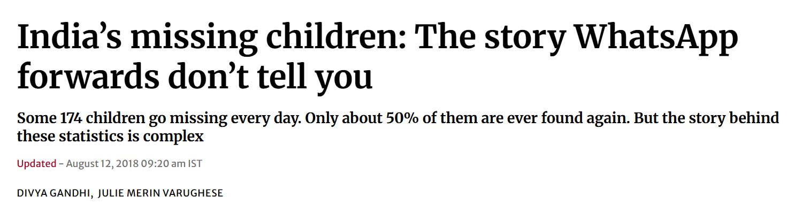
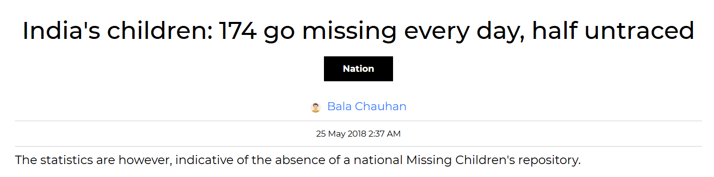

# Missing Person Identification System

 


> [ Endorse on LinkedIn](https://www.linkedin.com/in/gaganmanku96/) if this project was helpful.

---

## The Problem

Hundreds of people — mostly children — go missing every day in India. When a sighting is reported, officers have to manually compare photos, sift through paperwork, and coordinate across stations. By the time a match is confirmed, the trail has often gone cold.




---

## The Solution

A two-portal web app that connects officers registering missing cases with the public reporting sightings — and uses AI to match faces automatically.

1. **Officer registers a case** → uploads a photo → AI extracts a 468-point face mesh
2. **Public submits a sighting** → uploads a photo or video → same extraction
3. **Admin clicks Refresh** → KNN matches faces across both datasets → email sent to complainant on match

No manual photo comparison. No paperwork pile-up.

---

## Screenshots

<!-- Add screenshots here -->

---

## Features

| Feature | Details |
|---|---|
| Face detection | MediaPipe Face Landmarker — highlights detected faces, handles multiple people in frame |
| AI matching | KNN on 1,404-dimensional face vectors; shows confidence % |
| Video sightings | Upload a video — unique faces extracted automatically per frame |
| Live map | Dashboard map showing case density by city across India |
| Email alerts | Auto-notifies complainant email when a match is confirmed |
| Role-based access | Admins can match, edit, delete; Officers can register and view |
| Public portal | Separate mobile-friendly submission page, no login needed |

---

## Getting Started

```bash
git clone https://github.com/gaganmanku96/Finding-missing-person-using-AI.git
cd Finding-missing-person-using-AI
pip install -r requirements.txt
```

Copy and configure credentials:
```bash
cp login_config.yml.example login_config.yml  # edit with your credentials
```

Run the officer/admin portal:
```bash
streamlit run Home.py
```

Run the public submission portal:
```bash
streamlit run mobile_app.py
```

The SQLite database and face landmarker model (~30 MB, auto-downloaded on first use) are created automatically.

### Optional: Email notifications

Set these environment variables to enable email alerts on match:
```
SMTP_HOST, SMTP_PORT, SMTP_USER, SMTP_PASSWORD
```
The complainant's email entered during case registration is used as the recipient.

---

## Tech Stack

- **Streamlit** — UI for both portals
- **MediaPipe Tasks** — face mesh landmark extraction (468 points × 3D)
- **scikit-learn KNN** — face matching
- **SQLModel + SQLite** — data storage
- **Folium** — interactive map
- **OpenCV** — video frame extraction

---

*Thanks to the [MediaPipe](https://mediapipe.dev/) team for the open-source face landmarker model.*
